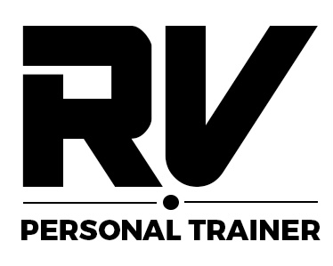

# RVPT WEBSITE

This is a Personal Training website designed to help provide information to people new to the fitness industry but more so, help generate leads (potential clients). 

Ideally most users of this website are perhaps considering getting themselves a personal trainer. They will find this website useful, they would have hopefully learned at least one new thing about workouts or nutrition, they would have learnt more about myself and my PT business, but ultimately, they end up completing the enquiry form at the end, in the hopes that they end up becoming a client of mine.
 
## TABLE OF CONTENTS

| Section | Line it starts on | 
| --- | --- |
| Project Logo, title and desciption | line 1 |
| Table of Contents | line 9 |
| Features | line 23 |
| UX / UI Section | line ... |
| Testing | line ... |
| Unfixed Bugs | line ... |
| Deployment | line ... |
| Credit | line ... |
| Future Features | line ... |

## FEATURES
talk about the webiste features, what they are intended to do and perhaps explain why. Why that layout/structure.

## UX/UI SECTION
The sections you should have here 
● Site Goals
● Design choices
● User stories
● Wireframes
● Database structure(PP3, PP4, PP5)
● Anything else you want to add that relates to UX/UI

Include screenshots

## TESTING
Did you test html code on W3C validator or CSS code on (Jigsaw) validator. Convince reader that enough testing has been done and that the site works well.

| Feature | Expect | Action | Result |
| --- | --- |
| Home Navbar Button | When clicked, the home page will open | Clicked Home on the Navbar | Home page opened when clicked - Success |
| Form Submit Button | The form submits when submit button is clicked | Clicked submit button on the form | The form successfully submitted when submit was clicked |

Include screenshots

## UNFIXED BUGS
Are there any? Why have they not been fixed?

## DEPLOYMENT
This section should describe the process you went through to deploy the project to a hosting platform (e.g. GitHub)

The site was deployed to GitHub pages. The steps to deploy are as follows:
In the GitHub repository, navigate to the Settings tab
From the source section drop-down menu, select the Master Branch
Once the master branch has been selected, the page will be automatically refreshed with a detailed ribbon display to indicate the successful deployment.
The live link can be found here -

## CREDIT
In this section you need to reference where you got your content, media and extra help from. It is common practice to use code from other repositories and tutorials, however, it is important to be very specific about these sources to avoid plagiarism.

You can break the credits section up into Content and Media, depending on what you have included in your project.

### Images:  
- All images used are primary sources (my own)  
- I received permission to use photos of others   

### Links used for text content only:  

#### Links used for Workout Info:  

Weightlifting:  
- https://personaltouchfitness.co.uk/healthy-advice/physical-wellbeing/muscular-endurance/#:~:text=Muscular%20endurance%20is%20the%20ability,of%20repetitions%20you%20could%20complete  

Cardio:  
- https://www.realbuzz.com/articles-interests/fitness/article/what-is-cardiovascular-training/  
- https://www.mayoclinic.org/healthy-lifestyle/fitness/in-depth/aerobic-exercise/art-20045541  
- https://www.healthline.com/health/fitness-exercise/benefits-of-aerobic-exercise  

Stretching:  
- https://www.health.harvard.edu/staying-healthy/the-importance-of-stretching  
 
#### Links used for Nutrition:

Carbs:  
- https://www.reidhealth.org/blog/carbohydrates-101-the-benefits-of-carbohydrates#:~:text=Carbohydrates%20are%20your%20body's%20main,blood%20cholesterol%20levels%20in%20check  
- https://medlineplus.gov/carbohydrates.html#:~:text=What%20are%20carbohydrates%3F,cells%2C%20tissues%2C%20and%20organs  
- https://www.newhealthadvisor.org/Sources-of-Carbohydrates  
- html#:~:text=Best%20Sources%20of%20Carbohydrates%201%201.%20Sweet%20Potato,Bananas%20...%208%208.%20Chestnuts%20...%20More%20items  

Protein:  
- https://www.hsph.harvard.edu/nutritionsource/what-should-you-eat/protein/  
- https://www.nutrition.org.uk/healthy-sustainable-diets/protein/?level=Consumer  
- https://www.mountsinai.org/health-library/tests/hemoglobin  
- https://weighttraining.guide/nutrition/protein-in-weight-training/#:~:text=Why%20is%20protein%20important%20for%20weight%20training%3F%20Protein,fibers%20after%20they%20have%20been%20damaged%20by%20workouts  
- https://www.bbcgoodfood.com/howto/guide/best-sources-protein  

 
Fats:  
- https://www.nhs.uk/live-well/eat-well/food-types/different-fats-nutrition/  
- https://meritagemed.com/15-good-fats-eat/#:~:text=15%20Good%20Fats%20To%20Eat%201%201.%20Dark,...%208%208.%20Fatty%20Fish%20...%20More%20items  

#### Links used for README.md file:  
https://www.freecodecamp.org/news/how-to-write-a-good-readme-file/  

#### CSS Links:
- https://torquemag.io/2022/05/customize-text-css/#:~:text=You%20simply%20determine%20the%20element,such%20as%20serif%20or%20monospace%20  
- https://webaim.org/resources/contrastchecker/  
- https://stackoverflow.com/questions/14628601/can-i-add-background-color-only-for-padding  
- https://medium.com/@dylanon/throwing-shade-how-to-shade-images-in-html-css-9d37b17b9d10  

 

## FUTURE FEATURES  
Images:  
- Get better quality images  

Testimonials:
- Give testimonials its own page where I can have more reviews and include before/after photos  

Workout Info:  
- Add a section for home workouts and gym workouts  
- Add a section that explains the benefits of a split routine. Such as why it's better to do an upper body workout one day and then lower body the next, as opposed to two full body workouts  
- Add a section that talks about Boxing, Spin classes, HIIT classes, Yoga and other training styles/classes  
- Add a section that explains why supplements could be beneficial such as whey protein or creatine tablets  
- Add a monthly subscription section where members can sign up for my programme which includes a generic workout and nutrition plan which they can follow along to. This is a cheaper alternative to PT but can generate great income for the business  

Nutrition:  
- Add more content to the Carbs, Protein and Fats sections  
- Talk about fibre and fruit and veg  
- Talk about vitamins. What are the best sources for them and whether or we should be vitamin tablets  
- Add a section for Vegans, Vegetarians and Pescetarians  
- Add a section about lactose free and gluten free foods  

Clients and Members:  
- Add a members section where only PT clients and members of my monthly subscription programme have access  
- In this section, they can interact with eachother, get exclusive content and have their own workout progress tracker  