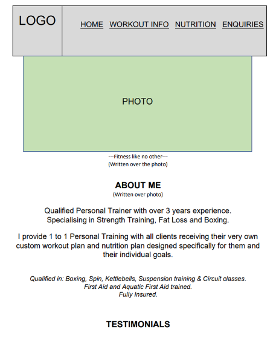

# RVPT WEBSITE

This is a Personal Training website designed to help provide information to people new to the fitness industry but more so, help generate leads (potential clients). 

Ideally most users of this website are perhaps considering getting themselves a personal trainer. They will find this website useful, they would have hopefully learned at least one new thing about workouts or nutrition, they would have learnt more about myself and my PT business, but ultimately, they end up completing the enquiry form at the end, in the hopes that they end up becoming a client of mine.
 

## TABLE OF CONTENTS

| Section | Line it starts on | 
| --- | --- |
| [Project Logo, title and desciption]() | line 1 |
| [Features](#features) | line 25 |
| UX / UI Section | line 40 |
| Testing | line ... |
| Unfixed Bugs | line ... |
| Deployment | line ... |
| Credit | line ... |
| Future Features | line ... |

## FEATURES
- The navbar has a logo of the business with a dark background to separate it from the page contents.  
- Just like the navbar, the footer has the same color theme. This color repetition and structure is said to make user experiences better. They like it when a website has a common theme/layout so that it then becomes quick to learn/easy to use. The green color used is supposed to be nice neutral color, but also represent grass and an outdoor feel as my sessions are predominantly delivered in parks.  
- The footer is also being used as a sales point leading users to the enquire page and my social accounts, both designed to help bring in new clients.  
- The first page is naturally the home page. Where users learn about the business. The next page is then all about workouts. As nutrition will partly depend on the workout style you opt for, people should first know what they want to train, so that when reading the nutrition, they know what they need to prioritise. Lastly, the enquire page, where if users have enjoyed the content and want to take it further and start personal training sessions, they are able to complete a form to begin PT.   
- The Home page is deliberately designed and layed out in this manner, so that the first thing seen is the trainer, the business name and a brief overview of the business. It's supposed to reassure users that this is a legitimate business that they can trust in. Putting a face to the business is one of the first steps in helping users trust the business.  
- It is followed by testimonials to help further the users trust into the business and to provide them with previous client experiences and what they could be receiving too should they sign up to PT.  
- On the workouts page, weightlifting must be first for two reasons. Firstly, I specialise in strength training, so it naturally makes sense to talk about this first. Secondly, there is a lot of misconception regarding weightlifting, so before we go any further, I feel as though this should be clarified.  
- The cardio section will then go next followed by stretching, due to the popularity and importance the two have in my business (cardio being more important).  
- We then move onto the Nutritions page where we talk about the 3 main macronutrients which are the main sources of fuel our body needs. A typical person will need 50% carbs, 30% protein, 20% fats, hence why I presented them in this order.  
- Lastly, the enquire page, summarising why you should train with me, followed by a form to complete if interested in personal training. 
- Each photo is deliberately selected to match with the topic we are talking about. All text is written over the photo relating to that section which we are talking about. I aim to create clear division in topics by having them displayed on different photos. So each photo, is a different topic. This structure stayed consistent throughout to keep the user experience good.
- As this website has many pictures with lots of colors, I wanted to keep the text simple and clear, which is why I opted for a lack of font-awesome icons and a dark shade over photos to aid the reading experience. Plus I feel as though the font-awesome icons would have just been of the same thing as the background image, which I feel there is no need to repeat.  

## UX/UI SECTION  

### Site Goals:
-  The goals of this site is inform users about the Personal Training business, general health and fitness knowledge and make them wanting more and signing up for PT sessions. The site should be easy to navigate through, consistent with design, as well as make users want to visit again. It should be aestetically pleasing with all text being clear to read, all generating a good user experience.  

### Design Choices:
- Black navbar and footer have been choosen to be this color to clearly separate it from the main conents of the page.  
- Green color when hovering is meant to indicate grass as most sessions will be outside at local parks.  
- Colorful photos, with all workout photos being outdoors as this will be the primary location of sessions.  

### User Stories:
As a person new to fitness:
- I am looking to learn some information about workouts and food to help get me started  
- I want to learn about the Personal Trainer and see if they know their stuff and can bring me value  
- I want to see if I can envision doing private sessions with the trainer by gettin to know them better  
- I want to trust this trainer by seeing reviews/testimonials

As an experienced gym-goer starting to plateau:
- I am exploring the possibility of getting myself a trainer to help me    
- I want to leave this website knowing more stuff that can help me  

As a person wanting a PT:
- I need to see value in a trainer  
- I need to see testimonials  
- I need to work out if I will get along with them  

As an existing client:
- I need a place where I can track workouts/food intake  
- I need support from others going through the same process as me  
- I need extra benefits for being a client  

### Wireframes:
- To see the initial stage of the wireframe, press on this link:  
- [To see the second and final wireframe design, press on this link](wireframes/PT_website_wireframe.pdf)  
- 

-   
-   
-   
-   
-   
-   
-   

## Database structure (PP3, PP4, PP5):
- 

## Anything else relating to UX/UI:
- 

Include screenshots

## TESTING
Did you test html code on W3C validator or CSS code on (Jigsaw) validator. Convince reader that enough testing has been done and that the site works well.

| Feature | Expect | Action | Result |
| --- | --- |
| Home Navbar Button | When clicked, the home page will open | Clicked Home on the Navbar | Home page opened when clicked - Success |
| Form Submit Button | The form submits when submit button is clicked | Clicked submit button on the form | The form successfully submitted when submit was clicked |

Include screenshots

## UNFIXED BUGS
Are there any? Why have they not been fixed?

## DEPLOYMENT
This section should describe the process you went through to deploy the project to a hosting platform (e.g. GitHub)

The site was deployed to GitHub pages. The steps to deploy are as follows:
In the GitHub repository, navigate to the Settings tab
From the source section drop-down menu, select the Master Branch
Once the master branch has been selected, the page will be automatically refreshed with a detailed ribbon display to indicate the successful deployment.
The live link can be found here -

## CREDIT  

### Media:  
- I have used the Eatwell Guide image from the NHS (https://www.nhs.uk/live-well/eat-well/food-guidelines-and-food-labels/the-eatwell-guide/) on my Nutritions page.  
- All other images used are primary sources (my own) with permission received to use photos of clients should they be in them.  

### Content:  

#### Workout Info:

Weightlifting:  
- https://personaltouchfitness.co.uk/healthy-advice/physical-wellbeing/muscular-endurance/#:~:text=Muscular%20endurance%20is%20the%20ability,of%20repetitions%20you%20could%20complete  

Cardio:  
- https://www.realbuzz.com/articles-interests/fitness/article/what-is-cardiovascular-training/  
- https://www.mayoclinic.org/healthy-lifestyle/fitness/in-depth/aerobic-exercise/art-20045541  
- https://www.healthline.com/health/fitness-exercise/benefits-of-aerobic-exercise  

Stretching:  
- https://www.health.harvard.edu/staying-healthy/the-importance-of-stretching  
 
#### Nutrition:

Macronutrients:  
- https://www.bhf.org.uk/informationsupport/heart-matters-magazine/nutrition/ask-the-expert/macronutrients#:~:text=Macronutrients%20are%20the%20nutrients%20we,our%20micronutrients%20along%20with%20macronutrients  

Carbs:  
- https://www.reidhealth.org/blog/carbohydrates-101-the-benefits-of-carbohydrates#:~:text=Carbohydrates%20are%20your%20body's%20main,blood%20cholesterol%20levels%20in%20check  
- https://medlineplus.gov/carbohydrates.html#:~:text=What%20are%20carbohydrates%3F,cells%2C%20tissues%2C%20and%20organs  
- https://www.newhealthadvisor.org/Sources-of-Carbohydrates  
- html#:~:text=Best%20Sources%20of%20Carbohydrates%201%201.%20Sweet%20Potato,Bananas%20...%208%208.%20Chestnuts%20...%20More%20items  

Protein:  
- https://www.hsph.harvard.edu/nutritionsource/what-should-you-eat/protein/  
- https://www.nutrition.org.uk/healthy-sustainable-diets/protein/?level=Consumer  
- https://www.mountsinai.org/health-library/tests/hemoglobin  
- https://weighttraining.guide/nutrition/protein-in-weight-training/#:~:text=Why%20is%20protein%20important%20for%20weight%20training%3F%20Protein,fibers%20after%20they%20have%20been%20damaged%20by%20workouts  
- https://www.bbcgoodfood.com/howto/guide/best-sources-protein  
 
Fats:  
- https://www.nhs.uk/live-well/eat-well/food-types/different-fats-nutrition/  
- https://meritagemed.com/15-good-fats-eat/#:~:text=15%20Good%20Fats%20To%20Eat%201%201.%20Dark,...%208%208.%20Fatty%20Fish%20...%20More%20items  

Eatwell:
- https://www.nhs.uk/live-well/eat-well/food-guidelines-and-food-labels/the-eatwell-guide/  

#### Links used for README.md file:  
- https://www.freecodecamp.org/news/how-to-write-a-good-readme-file/  

#### CSS Links used to help for styling:  
- https://torquemag.io/2022/05/customize-text-css/#:~:text=You%20simply%20determine%20the%20element,such%20as%20serif%20or%20monospace%20  
- https://webaim.org/resources/contrastchecker/  
- https://stackoverflow.com/questions/14628601/can-i-add-background-color-only-for-padding  
- https://medium.com/@dylanon/throwing-shade-how-to-shade-images-in-html-css-9d37b17b9d10  
- https://m2.material.io/design/color/the-color-system.html#tools-for-picking-colors

## FUTURE FEATURES  
Images:  
- Get better quality images  

Testimonials:
- Give testimonials its own page where I can have more reviews and include before/after photos  

Workout Info:  
- Add a section for home workouts and gym workouts  
- Add a section that explains the benefits of a split routine. Such as why it's better to do an upper body workout one day and then lower body the next, as opposed to two full body workouts  
- Add a section that talks about Boxing, Spin classes, HIIT classes, Yoga and other training styles/classes  
- Add a section that explains why supplements could be beneficial such as whey protein or creatine tablets  
- Add a monthly subscription section where members can sign up for my programme which includes a generic workout and nutrition plan which they can follow along to. This is a cheaper alternative to PT but can generate great income for the business  

Nutrition:  
- Add more content to the Carbs, Protein and Fats sections  
- Talk about fibre and fruit and veg  
- Talk about vitamins. What are the best sources for them and whether or we should be vitamin tablets  
- Add a section for Vegans, Vegetarians and Pescetarians  
- Add a section about lactose free and gluten free foods  

Clients and Members:  
- Add a members section where only PT clients and members of my monthly subscription programme have access  
- In this section, they can interact with eachother, get exclusive content and have their own workout progress tracker  