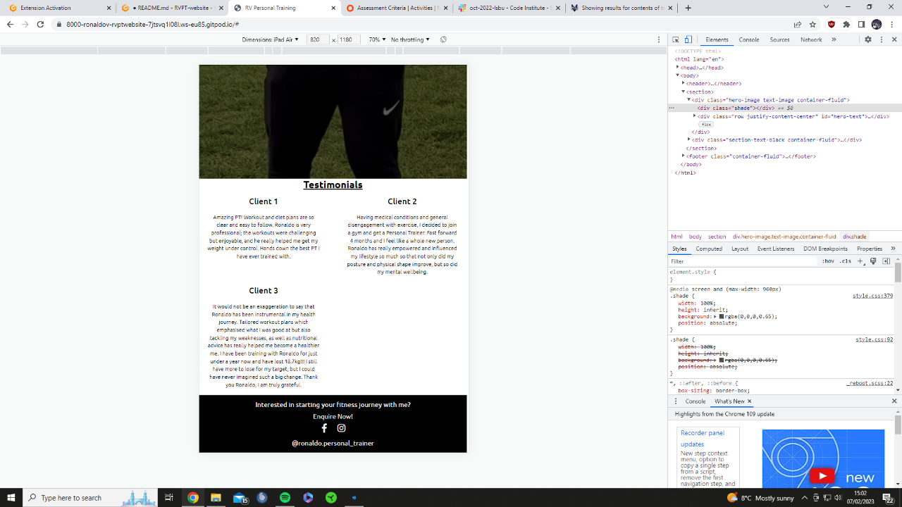

# RVPT WEBSITE
This is a Personal Training website designed to help provide information to people new to the fitness industry but more so, help generate leads (potential clients). 

Ideally most users of this website are perhaps considering getting themselves a personal trainer. They will find this website useful, they would have hopefully learned at least one new thing about workouts or nutrition, they would have learnt more about myself and my PT business, but ultimately, they end up completing the enquiry form at the end, in the hopes that they end up becoming a client of mine.
 
## TABLE OF CONTENTS
| Section |
| --- |
| [Project Logo, title and desciption](#rvpt-website) |
| [Features](#features) |
| [UX / UI](#uxui-section) |
| [Testing](#testing) |
| [Unfixed Bugs](#unfixed-bugs) |
| [Deployment](#deployment) |
| [Credit](#credit) |
| [Future Features](#future-features) |

## FEATURES
- The navbar has a logo of the business with a dark background to separate it from the page contents.  
- Just like the navbar, the footer has the same color theme. This color repetition and structure is said to make user experiences better. They like it when a website has a common theme/layout so that it then becomes quick to learn/easy to use. The green color used is supposed to be nice neutral color, but also represent grass and an outdoor feel as my sessions are predominantly delivered in parks.  
- The footer is also being used as a sales point leading users to the enquire page and my social accounts, both designed to help bring in new clients.  
- The first page is naturally the home page. Where users learn about the business. The next page is then all about workouts. As nutrition will partly depend on the workout style you opt for, people should first know what they want to train, so that when reading the nutrition, they know what they need to prioritise. Lastly, the enquire page, where if users have enjoyed the content and want to take it further and start personal training sessions, they are able to complete a form to begin PT.   
- The Home page is deliberately designed and layed out in this manner, so that the first thing seen is the trainer, the business name and a brief overview of the business. It's supposed to reassure users that this is a legitimate business that they can trust in. Putting a face to the business is one of the first steps in helping users trust the business.  
- It is followed by testimonials to help further the users trust into the business and to provide them with previous client experiences and what they could be receiving too should they sign up to PT.  
- On the workouts page, weightlifting must be first for two reasons. Firstly, I specialise in strength training, so it naturally makes sense to talk about this first. Secondly, there is a lot of misconception regarding weightlifting, so before we go any further, I feel as though this should be clarified.  
- The cardio section will then go next followed by stretching, due to the popularity and importance the two have in my business (cardio being more important).  
- We then move onto the Nutritions page where we talk about the 3 main macronutrients which are the main sources of fuel our body needs. A typical person will need 50% carbs, 30% protein, 20% fats, hence why I presented them in this order.  
- Lastly, the enquire page, summarising why you should train with me, followed by a form to complete if interested in personal training. 
- Each photo is deliberately selected to match with the topic we are talking about. All text is written over the photo relating to that section which we are talking about. I aim to create clear division in topics by having them displayed on different photos. So each photo, is a different topic. This structure stayed consistent throughout to keep the user experience good.
- As this website has many pictures with lots of colors, I wanted to keep the text simple and clear, which is why I opted for a lack of font-awesome icons and a dark shade over photos to aid the reading experience. Plus I feel as though the font-awesome icons would have just been of the same thing as the background image, which I feel there is no need to repeat.  

## UX/UI SECTION  

### Site Goals:
-  The goals of this site is inform users about the Personal Training business, general health and fitness knowledge and ultimately get them to sign up for PT sessions. The site should be easy to navigate through, consistent with design, as well as make users want to visit again. It should be aestetically pleasing with all text being clear to read, all generating a good user experience.  

### Design Choices:
- Black navbar and footer have been choosen to be this color to clearly separate it from the main conents of the page.  
- Green color when hovering is meant to indicate grass as most sessions will be outside at local parks.  
- Colorful photos, with all workout photos being outdoors as this will be the primary location of sessions.  
- Writing over photos to help keep sections seperate with a clear image relating to the topic.  
- Ubuntu font selected as I feel as though it has a similar feel to the logo font used.  
- PT logo in the enquire section to reminder users that this is a legitimate company, while also providing a clear display of the logo as it is only seen elsewhere in the nav which is rather small.  

### User Stories:
As a website user:  
- I want to press on the logo and be taken to the home page
- I want to press home and be taken to the home page
- I want to press workout info and be taken to the the workout info page
- I want to press nutrition and be taken to the nurtrition page
- I want to press enquire now in the header and be taken to the enquire page
- I want to press the instagram icon and be taken to the businesses instagram account
- I want to press the facebook icon and be taken to the businesses facebook account
- I want to press enquire now in the footer and be taken to the enquire page
- I want to press Eatwell Guide and be redirected to the NHS website referncing this
- I want to press the download or print link in the nutritions page and have a printable/downloadable doc
- I want to press submit in the form and my form be submitted

As a person new to fitness:
- I want to learn new information about workouts and food to help get started on my fitness journey
- I want to trust the information provided by seeing reviews/testimonials about the business

As a person wanting a PT:
- I want to learn about the Personal Trainer and see if they know their stuff and can bring me value if I decide to train with them
- I want to see if I can envision doing private sessions with the trainer by gettin to know them/the business better  
- I need to see testimonials as I need to know how other people have found their training experinces with the PT

As an existing client:  
- I need a place where I can track workouts/food intake to see how much I am progressing  
- I need a support center with others going through the same process as me to help me stay on track when I feel like giving up  

### Wireframes:
-   
-   
-   
-   
-   
-   
-   

## TESTING

### Testing of website
| Feature | Expect | Action | Result |
| --- | --- | --- | --- |
| Home Navbar Button | When clicked, the home page will open | Clicked Home on the Navbar | Home page opened when clicked - Success |
| All other nav elements | When I click on 'Workout Info' 'Nutrition' or 'Enquire Now' on the Navbar, the relevant page will open | Clicked 'Workout Info' 'Nutrition' or 'Enquire Now' on the Navbar | The relevant page opened - Success |
| Facebook link | When clicked, I will be redirected to the businesses Facebook account | Clicked Facebook icon in the footer section | Was redirected to the facebook page - Success |
| Instagram link | When clicked, I will be redirected to the businesses Instagram account | Clicked Instagram icon in the footer section | Was redirected to the Instagram page - Success |
| Eatwell Guide link | Press NHS Eatwell Guide and be taken to the NHS website regarding this | Pressed on the NHS Eatwell Guide link | Was taken to the Eatwell Guide section on the NHS website - Success |
| Daily food planner link | Press download or print in nutritiongs page and be taken to the printable doc regarding this | Pressed on the download or print link in the nutritions page above the Eatwell Guide | Was taken to the food planner document - Success |
| Form Submit Button | The form submits when submit button is clicked | Clicked submit button on the form | The form submitted when the submit button was clicked - Success |
| Content responsiveness for various viewports | Text, images and all other related content should shrink when the device screen width gets smaller | I pressed inspect on my website, selected the device toolbar, changed the device to a smaller screen width | Images and text shrink while layout changes slightly. Relevant photo [here](#content-responsiveness) |
| Website responsiveness for various viewports | My website should not be able to scroll horizontally | I pressed inspect on my website, selected the device toolbar, changed the device to a smaller screen width | I see a thin white trim down the right side of the device likely caused by padding. This does not effect the functionality of the website, but it does not look appealing to users. Relevant photo [here](#website-viewport-for-ipad-and-iphone)|
| Nav responsiveness for various viewports | When I shrink my tab or load the website on a different device, The text, images and display will change slightly to suit the device I am on | I pressed inspect on my website, selected the device toolbar, changed the device to ipad, iphone and other devices | For devices 576px screen width+ there was no issues. But for devices 575px screen width or less, the Navbar disappeared. Relevant photo [here](#nav-viewport-for-iphone)|

### Content responsiveness:  
- 

### Website viewport for ipad and iphone:  
- 

### Nav viewport for iphone:  
- 

### Testing of HTML:  
- 
- 
- 
- 
- 
- 

### Testing of CSS:  
- 
- 
- 

### Lighthouse testing for performance, accessibility and best practices:
- 
- 
- 
- 

## UNFIXED BUGS
- Website Viewport issue where there is a thin white trim down the right side of some devices. It becomes more noticeable the smaller the device gets. Although no content is hidden, this needs to be fixed. Need to 'inspect' my website and find the issue.
- Nav Viewport issue for devices 575px screen width or less. The Navbar disappears and users cannot navigate through the page. Can be fixed with a dropdown menu for smaller devices. This needs to be fixed ASAP. Have not had enough time to resolve the issue. Image shows the issue to be resolved.
 

## DEPLOYMENT
The project was developed in Gitpod, committed and push to GitHub through using the terminal section in Gitpod.
To deploy this page to GitHub pages from its GitHub repository, the following steps were taken:
1. Log into GitHub
2. From the list of repositories on the screen, select RVPT-website
3. From the menu list near the top below the project name, select settings
4. There will be a nav down the left of the screen. Find pages and select it when found
5. Select the branch dropdown which will say none and change it to main
6. Press the save button to the right of it

How to run this project locally:
1. To clone this project into Gitpod you will need a GitHub account
2. Use the Chrome browser

Then follow the steps:
1. Install Gitpod Browser Extensions for Chrome
2. After installation, restart the browser
3. Log into Gitpod with your Gitpod account
4. Navigate to the projet GitHub repository
5. Click the green 'Gitpod' button in the top right corner of the repository
6. This will trigger a new Gitpod workspace to be created from the code in GitHub where you can work locally

## CREDIT  

### Media credit:  
- I have used the Eatwell Guide image from the NHS (https://www.nhs.uk/live-well/eat-well/food-guidelines-and-food-labels/the-eatwell-guide/) on my Nutritions page.  
- All other images used are primary sources (my own) with permission received to use photos of clients should they be in them.  

### Content credit:  

#### Workout Info:
Weightlifting:  
- https://personaltouchfitness.co.uk/healthy-advice/physical-wellbeing/muscular-endurance/#:~:text=Muscular%20endurance%20is%20the%20ability,of%20repetitions%20you%20could%20complete  

Cardio:  
- https://www.realbuzz.com/articles-interests/fitness/article/what-is-cardiovascular-training/  
- https://www.mayoclinic.org/healthy-lifestyle/fitness/in-depth/aerobic-exercise/art-20045541  
- https://www.healthline.com/health/fitness-exercise/benefits-of-aerobic-exercise  

Stretching:  
- https://www.health.harvard.edu/staying-healthy/the-importance-of-stretching  
 
#### Nutrition:
Macronutrients:  
- https://www.bhf.org.uk/informationsupport/heart-matters-magazine/nutrition/ask-the-expert/macronutrients#:~:text=Macronutrients%20are%20the%20nutrients%20we,our%20micronutrients%20along%20with%20macronutrients  

Carbs:  
- https://www.reidhealth.org/blog/carbohydrates-101-the-benefits-of-carbohydrates#:~:text=Carbohydrates%20are%20your%20body's%20main,blood%20cholesterol%20levels%20in%20check  
- https://medlineplus.gov/carbohydrates.html#:~:text=What%20are%20carbohydrates%3F,cells%2C%20tissues%2C%20and%20organs  
- https://www.newhealthadvisor.org/Sources-of-Carbohydrates  

Protein:  
- https://www.hsph.harvard.edu/nutritionsource/what-should-you-eat/protein/  
- https://www.nutrition.org.uk/healthy-sustainable-diets/protein/?level=Consumer  
- https://www.mountsinai.org/health-library/tests/hemoglobin  
- https://weighttraining.guide/nutrition/protein-in-weight-training/#:~:text=Why%20is%20protein%20important%20for%20weight%20training%3F%20Protein,fibers%20after%20they%20have%20been%20damaged%20by%20workouts  
- https://www.bbcgoodfood.com/howto/guide/best-sources-protein  
 
Fats:  
- https://www.nhs.uk/live-well/eat-well/food-types/different-fats-nutrition/  
- https://meritagemed.com/15-good-fats-eat/#:~:text=15%20Good%20Fats%20To%20Eat%201%201.%20Dark,...%208%208.%20Fatty%20Fish%20...%20More%20items  

Eatwell:
- https://www.nhs.uk/live-well/eat-well/food-guidelines-and-food-labels/the-eatwell-guide/  

#### Links used to help structure README.md file:  
- https://www.freecodecamp.org/news/how-to-write-a-good-readme-file/  

#### Links used to help for CSS styling:  
- https://torquemag.io/2022/05/customize-text-css/#:~:text=You%20simply%20determine%20the%20element,such%20as%20serif%20or%20monospace%20  
- https://webaim.org/resources/contrastchecker/  
- https://stackoverflow.com/questions/14628601/can-i-add-background-color-only-for-padding  
- https://medium.com/@dylanon/throwing-shade-how-to-shade-images-in-html-css-9d37b17b9d10  
- https://m2.material.io/design/color/the-color-system.html#tools-for-picking-colors  

#### Links used to help write HTML code:  
Bootstrap:  
- Navbar (https://getbootstrap.com/docs/4.5/components/navbar/)  
- Grid systems and grid options (https://getbootstrap.com/docs/4.5/layout/grid/#grid-options)  
- The table-bordered class only (https://getbootstrap.com/docs/4.5/content/tables/#bordered-table)  

## FUTURE FEATURES  
Images:  
- Get 4k quality images with minimal colors in background  

Testimonials:
- Give testimonials its own page where I can have more reviews and include before/after photos  

Workout Info:  
- Add a section for home workouts and gym workouts  
- Add a section that explains the benefits of a split routine. Such as why it's better to do an upper body workout one day and then lower body the next, as opposed to two full body workouts  
- Add a section that talks about Boxing, Spin classes, HIIT classes, Yoga and other training styles/classes  
- Add a section that explains why supplements could be beneficial such as whey protein or creatine tablets  
- Add a monthly subscription section where members can sign up for my programme which includes a generic workout and nutrition plan which they can follow along to. This is a cheaper alternative to PT but can generate great income for the business  

Nutrition:  
- Add more content to the Carbs, Protein and Fats sections  
- Talk about fibre and fruit and veg  
- Talk about vitamins. What are the best sources for them and whether or we should be vitamin tablets  
- Add a section for Vegans, Vegetarians and Pescetarians  
- Add a section about lactose free and gluten free foods  

Clients and Members:  
- Add a members section where only PT clients and members of my monthly subscription programme have access  
- In this section, they can interact with eachother, get exclusive content and have their own workout progress tracker  